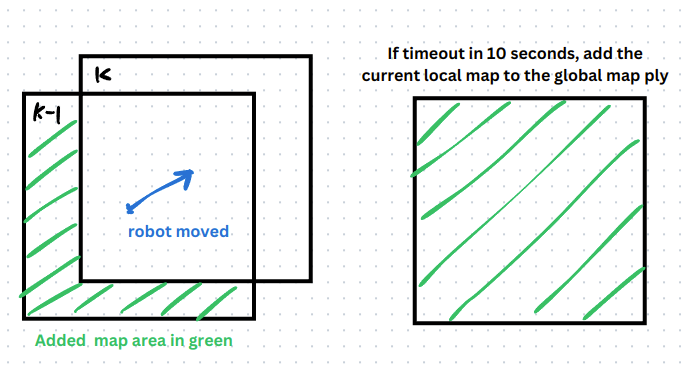
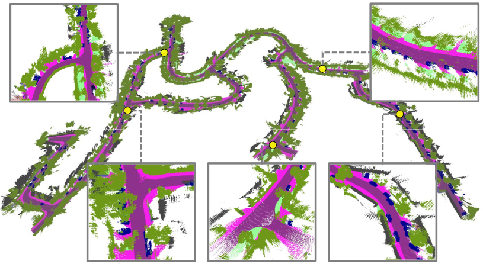

# dsp_global_mapping
This repo is an accessory of [semantic DSP map](https://github.com/tud-amr/semantic_dsp_map). Note semantic DSP map itself is designed for local mapping rather than global mapping. In this repo, a global mapping node subscribes the mapping result message from semantic DSP map and build a global map by saving the voxels that are removed (out of range of the local map) from t=k-1 to t=k. We illustrate this area in the following image. The global map is saved as a ply file. If no new message is received in 10 seconds, the global mapping node will add the lastest local mapping result to the ply to form a complete global map.



## Compile
Tested Environment: Ubuntu 20.04 + ROS Noetic. 
Please compile semantic DSP map first following [here](https://github.com/tud-amr/semantic_dsp_map)

Then
```
cd catkin_ws/src
git clone git@github.com:g-ch/dsp_global_mapping.git
catkin build
```

## Usage
Set the parameters in ```launch/global_mapping.launch```. The meanings of the parameters are:
- out_points_topic: local mapping result topic of semantic DSP map. default="/occupied_point"
- out_pose_topic: localization message that is synchronized with the local mapping. default="/map_pose"
- out_file: path to save the ply file.
- map_range_x: x direction size of the local map. It should be ```2^C_VOXEL_NUM_AXIS_X_N * C_VOXEL_SIZE```.
- map_range_y: y direction size of the local map. It should be ```2^C_VOXEL_NUM_AXIS_Y_N * C_VOXEL_SIZE```.
- map_range_z: z direction size of the local map. It should be ```2^C_VOXEL_NUM_AXIS_Z_N * C_VOXEL_SIZE```.
- voxel_size: voxel size. It should be ```C_VOXEL_SIZE```.
  ```
  Note: C_VOXEL_NUM_AXIS_X_N, C_VOXEL_NUM_AXIS_Y_N, C_VOXEL_NUM_AXIS_Z_N and C_VOXEL_SIZE are defined in settings.h of the semantic DSP map.
  ```
- write_color: If 0, color is not written in the map but the label id is, which can be uploaded to KITTI 360's server for evaluation. If 1, color is saved for visualization.
- object_csv: Path of the csv file that defines the id-label-color table. Use the same as the one you use in Semantic DSP map, e.g. in [this folder](https://github.com/tud-amr/semantic_dsp_map/tree/main/cfg).

Then
```
roslaunch dsp_global_mapping global_mapping.launch
```

The global map is completely saved 10 seconds after the semantic DSP map stops publishing new messages (terminated).

The following shows an example global map built with the KITTI 360 dataset.


## Citation
If you found our work useful, please cite the following.
```
@misc{chen2024particlebasedinstanceawaresemanticoccupancy,
title={Particle-based Instance-aware Semantic Occupancy Mapping in Dynamic Environments},
author={Gang Chen and Zhaoying Wang and Wei Dong and Javier Alonso-Mora},
year={2024},
eprint={2409.11975},
archivePrefix={arXiv},
primaryClass={cs.RO},
url={https://arxiv.org/abs/2409.11975},
}

@article{chen2023continuous,
  title={Continuous occupancy mapping in dynamic environments using particles},
  author={Chen, Gang and Dong, Wei and Peng, Peng and Alonso-Mora, Javier and Zhu, Xiangyang},
  journal={IEEE Transactions on Robotics},
  year={2023},
  publisher={IEEE}
}
```

## Liciense
Apache-2.0